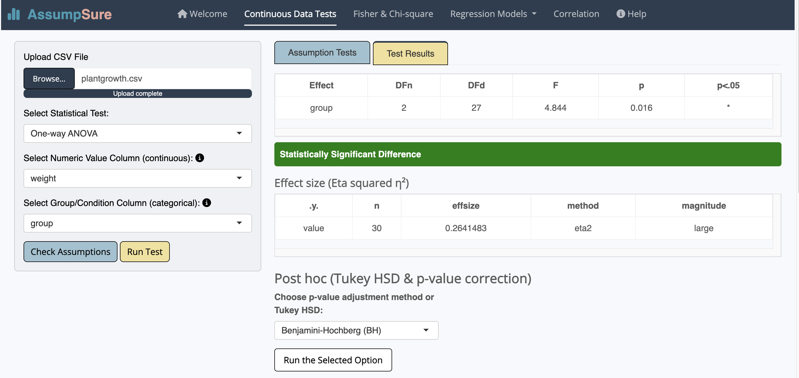
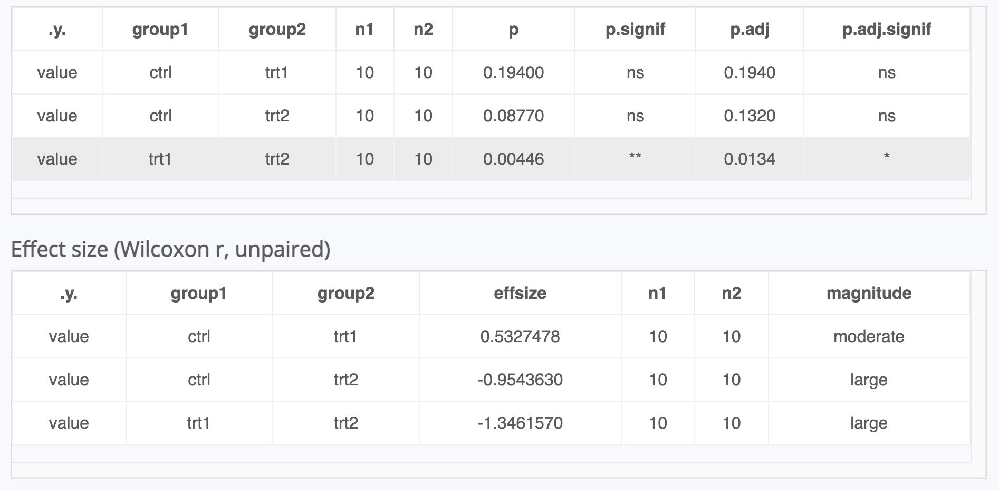
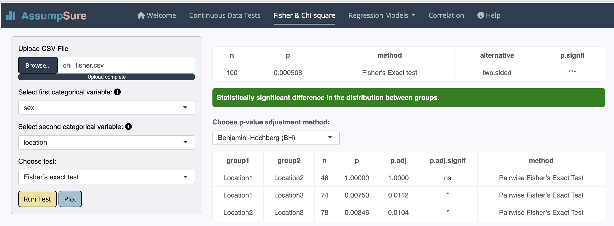

# AssumpSure

[](https://cran.r-project.org/package=AssumpSure)  [](https://www.repostatus.org/#active)


## 🎯 Purpose


**AssumpSure** is a user-friendly **R Shiny application** that helps researchers validate statistical assumptions and select appropriate tests before analysis, ensuring valid, transparent, and reproducible results.

Misused statistical tests due to overlooked or misinterpreted assumptions can undermine scientific findings. 

With **AssumpSure**, you can:

- **Validate** statistical assumptions automatically.
- **Choose** the right test for your data with confidence.
- **Generate** publication-ready plots and summaries in one click, demonstrating transparent test selection to reviewers and readers.

---

## 👥 Who is it for?

**AssumpSure** is perfect for:

- Researchers with limited statistical expertise.
- Students, clinicians, and early-career scientists seeking a **code-free analysis workflow**.
- Teams needing reproducible, publication-ready statistical outputs.
- Anyone unsure if their data meets test assumptions.

---

## 📦 Key Features

- **Automatically check** test assumptions (normality, homogeneity, homoscedasticity, collinearity, etc.).
- **Evaluate** your test selection and recommend alternatives when appropriate.
- **Apply** Log, Yeo-Johnson, or Box-Cox transformations to non-normal data for LM and LMM, with before-and-after visualizations.
- **Support** a wide range of statistical methods.
- **Generate** boxplots, effect plots, and diagnostic plots for transparent reporting.
- **Export** plots and tables for reports or publications with **one click**.
- **Provide** an intuitive interface for users with no programming experience.

---

## 🧪 Supported Statistical Methods

- T-tests (independent & paired)
- Mann-Whitney U test
- Wilcoxon signed-rank test
- One-way ANOVA
- Kruskal-Wallis test
- Chi-square and Fisher’s exact tests
- Correlation analyses (Pearson, Spearman, Kendall, and Biweight midcorrelation)
- Linear and linear mixed-effects models
- Logistic, multinomial, Poisson and negative binomial regression

---

## 📁 Installation
**Important:** Please use R 4.2 or newer.
### CRAN

```r
install.packages("AssumpSure")
```
### GitHub
```r
# Install devtools if not already installed
install.packages("devtools")
library(devtools)

# Install AssumpSure package
devtools::install_github("Ahmedbargheet/AssumpSure")
```

---

## 🚀 Launch the App

Either with
```r
library(AssumpSure)
launch_app()
```
or 

```r
AssumpSure::launch_app()
```

---

## 💻 Use Online

You can use **AssumpSure** without installing it (performance is slower online):  
https://ahmed-bargheet.shinyapps.io/AssumpSure/

---

## 📂 Data Format Guidelines

- Use **long format**: one row per subject/timepoint (see sample CSV included with the app)
- For longitudinal studies, name your time variable exactly ***timepoint***

---

## 📖 Citation
If you use **AssumpSure** in your research, please cite it as below.

Bargheet, Ahmed. "AssumpSure: A User-Friendly R Shiny Package for Automated Validation of Statistical Assumptions and Appropriate Test Selection." Available at SSRN: https://ssrn.com/abstract=5352013 or http://dx.doi.org/10.2139/ssrn.5352013.

---
## 📚 Reproducible Examples
The examples below demonstrate how to use each analysis module in *AssumpSure*.
The `infants.csv` dataset is downloadable within the app (Help tab), while the remaining example datasets are available [here](https://github.com/Ahmedbargheet/AssumpSure/tree/main/inst/extdata) on GitHub.
Screenshots display the expected outputs for verifying functionality and reproducibility.

### 1. Independent t-test  
**Dataset:** `t-test.csv`  
**Steps:**  
- Launch the app:
```r
AssumpSure::launch_app()
```
- Upload `t-test.csv` in the **Continuous Data Tests** tab.
- Choose **Independent T-test**.
- Select the numeric value and `Treatment` as a categorical value, and click **Check Assumptions**.
  


### 2. One-way ANOVA  
**Dataset:** `plantgrowth.csv`  
- Upload `plantgrowth.csv` in the **Continuous Data Tests** tab.  
- Choose **One-way ANOVA**.
- Choose the numeric value and the categorical value, and click **Check Assumptions**.
- Then click on **Run Test**, and choose **p-value adjustment method or Tukey HSD**, and click on **Run the Selected Option**
- Optionally, click **Plot Boxplot** to visualize group differences.
  





### 3. Fisher's exact test  
**Dataset:** `chi_fisher.csv`  
- Upload `chi_fisher.csv` in the **Fisher & Chi-square** tab.
- Choose **sex** as first categorical variable and **location** as second categorical variable.
- Choose **Fisher's exact test** from the **Choose test** drop menu and click on **Run Test**.
- Choose **Benjamini-Hochberg**
- Optionally, click **Plot** to visualize groups.
  



### 3. Linear Model  
**Dataset:** `infants.csv`  
- Upload `infants.csv` in the **Regression Models** tab.
- Choose **weight** as dependent variable and **Treatment, gender, country, nutrients, and diarrhea** as independent variables.
- Choose **Inverse normal** from the **Transform dependent variable** drop menu and click on **Check Assumptions**.
- Then click on **run LM** and **Plot Forest**.
  


### 4. Correlation  
**Dataset:** `correlation.csv`  
- Upload `correlation.csv` in the **Correlation** tab.
- Choose **Pearson** from the **Correlation Method** drop menu and click **Check Assumptions**.
  


### 5. Correlation for compositional data 
**Dataset:** `bacteria_for_correlation.csv`  
- Upload `bacteria_for_correlation.csv` in the **Correlation** tab.
- Tick **Apply CLR transformation**, and set **Remove features** to **20%** using the slider
- Choose **Spearman** from the **Correlation Method** drop menu and click **Run Correlation**.
- Select at least five features to display the heatmap.
- The user can download the heatmap, matrix, and table using the download buttons.

---
## 📚 Need Help?

For feedback or questions, feel free to contact me at ahmed.bargheet@yahoo.com
