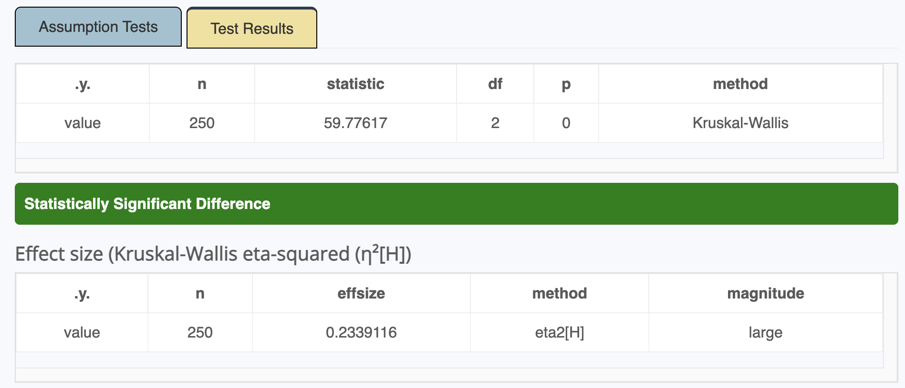
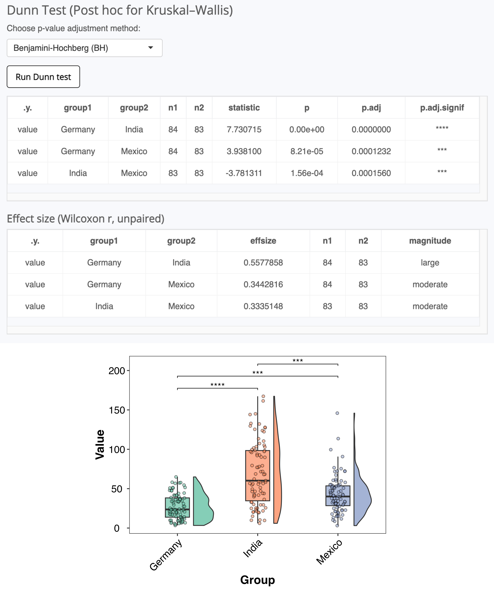

# Summary

`AssumpSure` is an open-source R Shiny package that enforces mandatory assumption checks to improve statistical rigor and guide appropriate test selection. It supports a wide array of statistical tests. The app automatically evaluates key assumptions such as normality (Shapiro–Wilk) and homogeneity of variance (Levene’s test), using color-coded indicators (green for passed, red for violated) with clear interpretive summaries. When assumptions are not met, it recommends alternatives like Kruskal–Wallis for non-normal ANOVA data. `AssumpSure` also prevents invalid variable types, provides preprocessing tools (log, Box–Cox, centered log-ratio transformations), and generates downloadable diagnostic plots and publication-ready outputs.

# Statement of Need
Rigorous statistical analysis depends on checking underlying assumptions and choosing appropriate tests. Yet in practice, these steps are often skipped, misunderstood, or incorrectly applied. Reviews of social science literature report that fewer than 25% of studies explicitly mention assumption checks, and even fewer report them correctly [@shatz2024assumption]. This contributes to widespread misuse of statistical tests and undermines reproducibility. One common issue is the misinterpretation of assumption tests. For example, many users mistakenly interpret a significant Shapiro–Wilk test result (*p* < 0.05) as evidence for normality rather than deviation from it [@ghasemi2012normality; @midway2025testing; @gosselin2024testing]. Moreover, in small samples, where the Shapiro–Wilk test lacks power, borderline results are easily overlooked or misjudged.

`AssumpSure` directly addresses these problems by making assumption checking a required part of the analysis workflow. Through an intuitive web interface, users are guided step-by-step: assumptions are tested automatically, results are color-coded (green for met, red for violated, orange for borderline), and clear recommendations are given. For example, if ANOVA assumptions are not met, Kruskal–Wallis is suggested. By complementing color-coded squares with tooltips and clear messages, `AssumpSure` helps reduce misinterpretation of common assumption tests and guide the user how to proceed.

# Comparison to other Packages
Tools like *Jamovi* [@csahin2019jamovi] and *JASP* [@love2019jasp] offer user-friendly interfaces but lack integrated workflows that enforce mandatory assumption diagnostics, appropriate test selection, and actionable recommendations, leaving users to manually interpret complex outputs. This increases errors and undermines reproducibility. Additionally, non-R applications such as assumption-sheriff (Python) [@assumptionsheriff] also aim to simplify statistical assumption checking and test selection. However, these alternatives lack fully integrated, interactive diagnostic workflows or do not provide enforced guidance on test appropriateness for each step.

# Software Description
`AssumpSure`’s modular R Shiny architecture organizes statistical analyses into continuous variable tests, categorical tests, correlations, and regression models. Users upload CSV data, and the interface automatically detects variable types, preventing invalid selections with clear error messages (e.g., suggesting one-way ANOVA if a t-test is chosen for a categorical variable with three levels). Mandatory assumption diagnostics (normality via Shapiro-Wilk, variance homogeneity via Levene’s test) are visualized through diagnostic plots (QQ plots, histograms, scatter plots), with tooltips to guide the user how to interpret the plots.

For correlations, a tooltip explains the centered log-ratio (CLR) transformation’s importance, conducted by compositions R package [@van2013package], in reducing spurious correlations in compositional data (e.g., microbiome profiles). Prevalence filtering is available for correlations to enhance reliability. Regression models leverage the performance package [@ludecke2021performance], providing transformations like log or Box-Cox are offered to improve residual normality and reduce heteroscedasticity, with guidance on their role in ensuring model validity. 

The package supports independent/paired t-tests, Welch test, one-way ANOVA, Mann-Whitney U, Wilcoxon signed-rank, Kruskal-Wallis, chi-square, Fisher’s exact, linear, logistic, multinomial, Poisson, negative binomial, zero-inflated negative binomial, and mixed-effects models, plus Pearson, Spearman, Kendall, and biweight midcorrelation methods. Post-hoc comparisons (e.g., Tukey HSD, Dunn’s test) and multiple testing corrections (e.g., Benjamini-Hochberg) are included where applicable. Outputs, including p-values, confidence intervals, effect sizes, and publication-ready plots, are exportable in PNG, PDF, or CSV formats for transparent reporting as suggested by researchers [@shatz2024assumption]. `AssumpSure` integrates R libraries like *rstatix* [@kassambara2019rstatix], *performance* [@ludecke2021performance], *lmerTest* [@kuznetsova2015package], *MASS* [@ripley2013package], and *bestNormalize* [@peterson2020package] for robust functionality, with all used package listed in the DESCRIPTION file.

Figure 1: The workflow from data upload to test selection, guiding users to switch to the appropriate statistical test.

# Illustrative Example
A researcher uploads a CSV dataset, imported using the readr package [@wickham2024package] with bacterial alpha diversity (Shannon index) across three countries. `AssumpSure` detects variable types, restricting invalid selections (e.g., excluding count variables for ANOVA). Selecting one-way ANOVA triggers normality (Shapiro-Wilk) and homogeneity (Levene’s) checks using the rstatix package [@kassambara2019rstatix], visualized via QQ plots and histograms with ggplot2 [@wickham2011ggplot2] with tooltips implemented using the shiny package [@chang2015package] (which provides the icon() function and HTML integration for Bootstrap tooltips). A red indicator signals non-normality and heterogeneous variances, recommending Kruskal-Wallis (Figure 2). Switching to this test, the user obtains significant results (*p* < 0.05) and effect size using Kruskal-Wallis eta-squared (Figure 3), also based on rstatix [@kassambara2019rstatix]. The user can run Dunn's with p-value correction such as Benjamini-Hochberg based on rstatix R package [@kassambara2019rstatix], and downloading a publication-ready boxplot (Figure 4). This workflow, requiring no coding, ensures valid test selection and transparent reporting for researchers with minimal statistical expertise.

Figure 2: The assumption checking report.

Figure 3: Kruskal-Wallis test and effect sizes estimation using Kruskal-Wallis eta-squared.

Figure 4: Dunn test and Wilcoxon r unpaired test for effect size, and publication-ready boxplot.

# Limitations
`AssumpSure` accepts UTF-8, comma-delimited CSV files with a header row (parsed by readr package [@wickham2024package]. Unusual delimiters or encodings are not supported. There is no strict size limit, but large files may slow performance. `AssumpSure` visualizes assumption checks using diagnostic plots (e.g., from the *performance* package [@ludecke2021performance]) and provides general guidance via tooltips, but does not generate automated, context-specific recommendations. Users should interpret plots with the provided guidance.

# Licensing and Availability
`AssumpSure` is licensed under the GPL-3 license, with all source code stored at GitHub (<https://github.com/Ahmedbargheet/AssumpSure>). In the spirit of honest and open science, we encourage requests, tips for fixes, feature updates, as well as general questions and concerns via direct interaction with the developer.

# Acknowledgments
`AssumpSure` acknowledges the open-source R community for maintaining the packages that support the application’s statistical and graphical functionality.

# References
